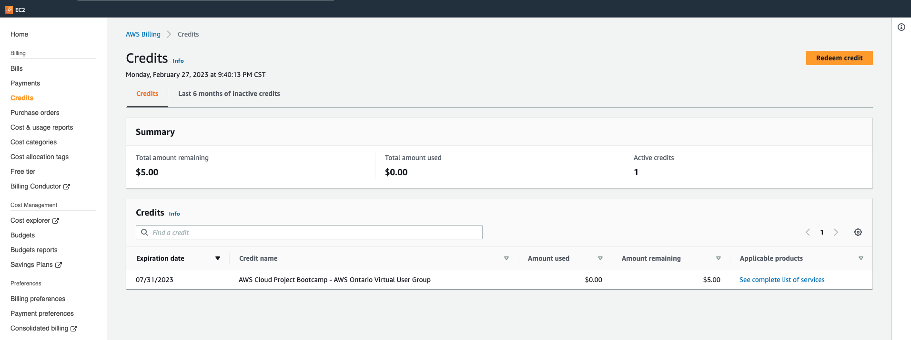

# Week 0 — Billing and Architecture

## Required Homework

- Created AWS Admin account
- Enabled MFA for Root Account and Admin Account
- Created Alias for account ID - to make it easier for loggin in as the admin account and not the root account.
- Created Billing Alarm 
- Created Policy to allow Adm user to view Billing Console.

## Created Lucid Chart 

##  Created Bill for KMS

## Applied AWS Credits

